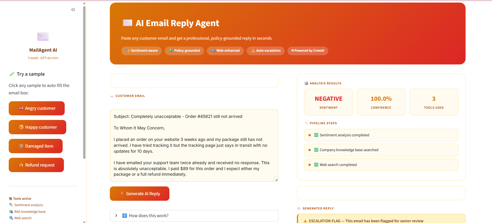
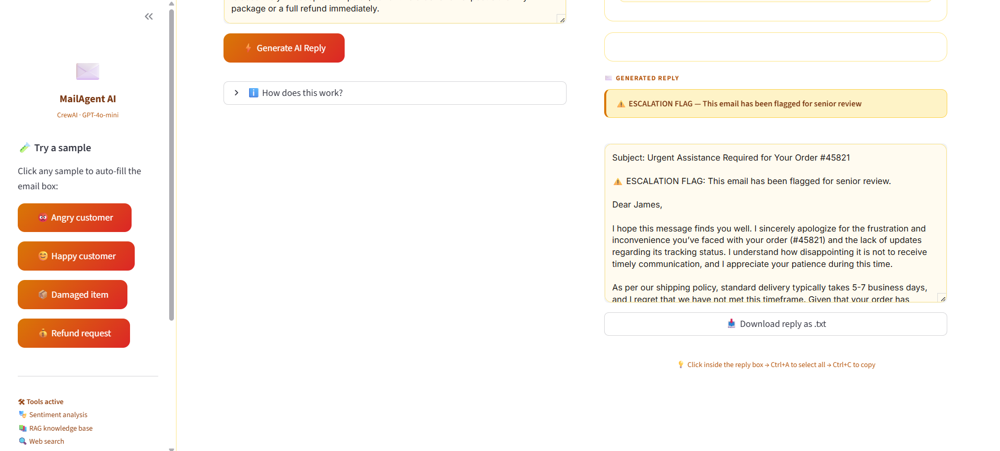

# ✉️ AI Email Triage & Reply Agent

An intelligent email generation system that reads incoming customer emails, understands their tone, retrieves relevant company policies, and automatically generates professional replies — all powered by AI agents working together.

---

## 📸 Screenshots

### Input and Analysis

*Paste any customer email — the system detects sentiment, searches company policies, and fetches web best practices automatically*

### Generated Reply with Escalation Flag

*A professional, policy-grounded reply is generated in seconds — with an automatic escalation flag for angry or negative emails*

---

## 🚀 What This Project Does

A customer sends an angry email about a delayed order. Instead of a support agent spending time researching policies and crafting a reply, this system does it automatically in under 60 seconds:

1. **Detects the tone** — is the customer angry, happy, or neutral?
2. **Finds the right policy** — searches company documents like shipping rules and refund policies
3. **Checks best practices** — searches the web for how to handle this type of complaint
4. **Writes the reply** — produces a professional, empathetic email that references actual company policy
5. **Flags escalations** — if the email is strongly negative, it is automatically marked for senior review

---

## ✨ Key Features

- 🎭 **Sentiment Analysis** — detects positive or negative tone with a confidence score
- 📚 **RAG Pipeline** — retrieves the most relevant company policy from an internal document store
- 🔍 **Web Search** — finds real-time best practices for handling the customer's issue
- ⚠️ **Auto Escalation** — strongly negative emails are flagged automatically for senior review
- 🎨 **Clean Web Interface** — simple and intuitive UI with one-click sample emails
- 📥 **Download Reply** — save any generated reply as a text file

---

## 🛠️ Tech Stack

| Layer | Technology |
|---|---|
| Agent framework | CrewAI |
| Language model | GPT-4o-mini (OpenAI) |
| Sentiment analysis | DistilBERT (HuggingFace) |
| Vector database | ChromaDB |
| Embeddings | OpenAI text-embedding-3-small |
| Web search | DuckDuckGo Search |
| Web interface | Streamlit |
| Language | Python 3.12 |

---

## 🧠 How the AI Agents Work

This project uses two AI agents that work in sequence:

**Agent 1 — The Analyst**
Reads the incoming email and uses three tools to gather information. It analyses the sentiment, searches the company knowledge base for relevant policies, and searches the web for best practices. It then produces a structured briefing.

**Agent 2 — The Writer**
Reads the analyst's briefing and writes the final email reply. It matches the tone to the sentiment — empathetic for negative emails, friendly for positive ones — and always references the actual company policy in the reply.

---

## 📚 Company Knowledge Base

The system comes loaded with five company documents that agents can search:

| Document | What it contains |
|---|---|
| Shipping Policy | Delivery times, delay compensation, store credit rules |
| Refund Policy | Return window, refund processing time, conditions |
| Customer Service Guidelines | Tone guidelines, escalation rules, response targets |
| Warranty Information | Product warranty periods and claim process |
| FAQ | Common customer questions and standard answers |

---

## ⚠️ Escalation Logic

An email is automatically flagged for senior review when:

- The sentiment is detected as **NEGATIVE**
- The confidence score is **above 85%**

When this happens, the reply includes a clear escalation banner at the top so no urgent case slips through.

---

## 💡 Sample Emails to Try

The app includes four built-in sample emails to demonstrate different scenarios:

| Sample | What it demonstrates |
|---|---|
| 😡 Angry customer | Delayed order — triggers escalation flag and empathetic reply |
| 😊 Happy customer | Positive feedback — triggers friendly, upbeat reply |
| 📦 Damaged item | Broken delivery — retrieves warranty and refund policy |
| 💰 Refund request | Wrong item received — retrieves returns policy |

---

## ⚙️ How to Run This Project

**Requirements:** Python 3.10 or higher and an OpenAI API key

**Step 1** — Clone the repository and navigate into the folder

**Step 2** — Create and activate a virtual environment

**Step 3** — Install all dependencies using requirements.txt

**Step 4** — Add your OpenAI API key to a .env file

**Step 5** — Run the app with streamlit run app.py and open your browser at http://localhost:8501

---

## 🔮 Future Improvements

- Add a history tab to track all emails processed in a session
- Support uploading custom PDF documents to the knowledge base
- Add multi-language support for international customers
- Deploy publicly on Streamlit Community Cloud
- Integrate with Gmail and Outlook to send replies directly

---

## Author

Built by **Shivani Harane**

